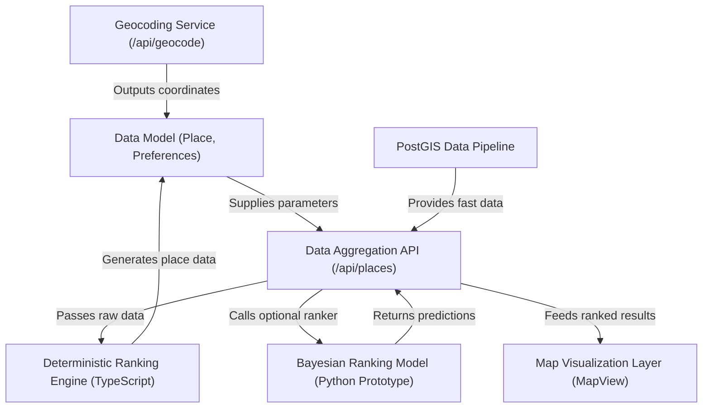
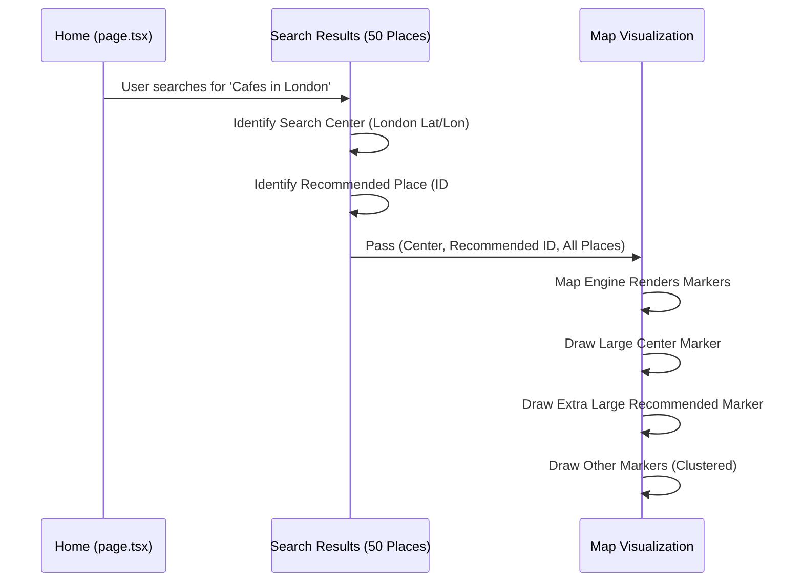
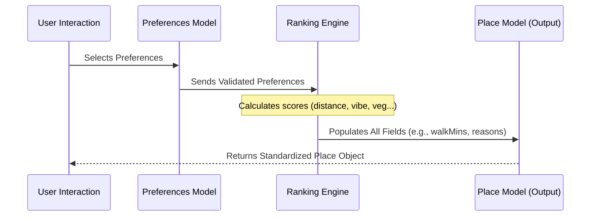
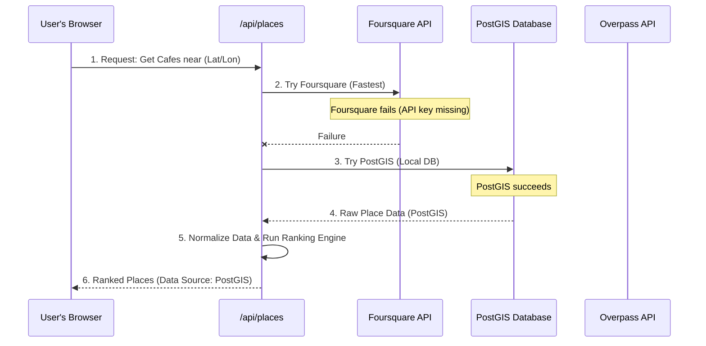
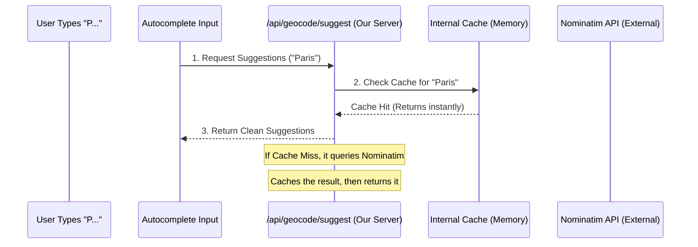
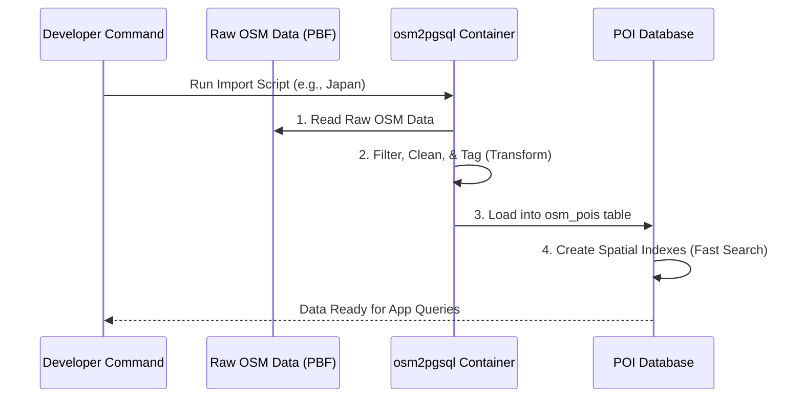
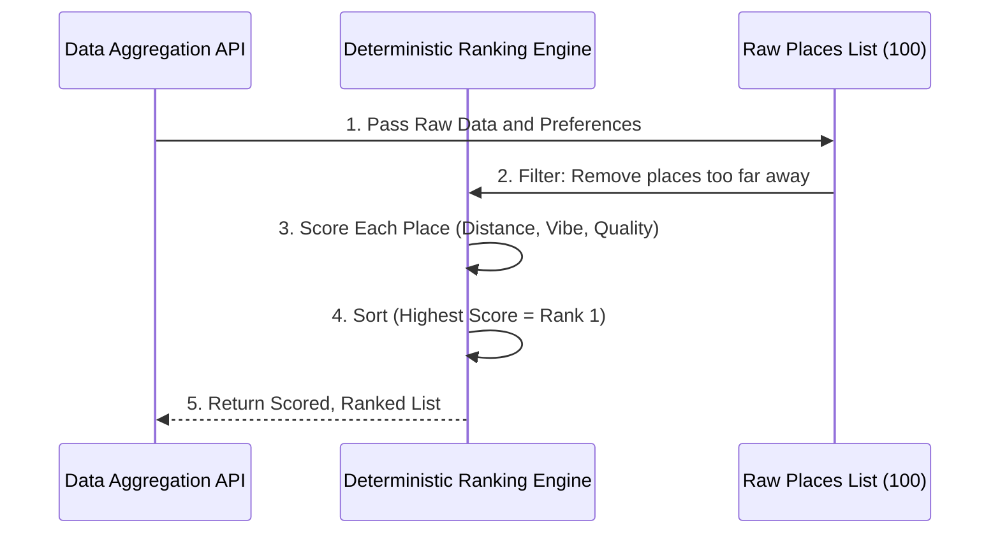
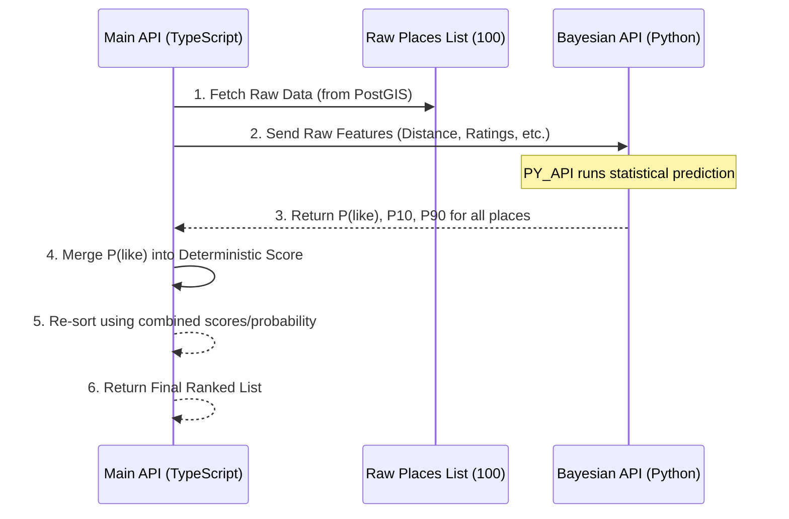

# Tutorial: Geo-Based-Travel-Recommendation-System

This project is a sophisticated **Geo-Based Travel Recommendation System** that helps users find personalized points of interest. It takes user *Preferences* (location, vibe, walking time) and aggregates data from multiple **OpenStreetMap** sources (PostGIS, Overpass, Foursquare). The system then employs a core *Deterministic Ranking Engine*, optionally enhanced by a **Bayesian Model**, to produce highly relevant, score-based recommendations displayed instantly on an interactive *Map Visualization*.


## Visual Overview



## Chapters

1. [Map Visualization Layer (MapView)
](01_map_visualization_layer__mapview__.md)
2. [Data Model (Place, Preferences)
](02_data_model__place__preferences__.md)
3. [Data Aggregation API (/api/places)
](03_data_aggregation_api___api_places__.md)
4. [Geocoding Service (/api/geocode)
](04_geocoding_service___api_geocode__.md)
5. [PostGIS Data Pipeline
](05_postgis_data_pipeline_.md)
6. [Deterministic Ranking Engine (TypeScript)
](06_deterministic_ranking_engine__typescript__.md)
7. [Bayesian Ranking Model (Python Prototype)
](07_bayesian_ranking_model__python_prototype__.md)


# Chapter 1: Map Visualization Layer (MapView)

Welcome to the first chapter! We are starting our journey by looking at the component the user interacts with most immediately: the interactive map.

## 1. The Need for a Map

Imagine you search for the perfect café. A list of addresses is helpful, but seeing them scattered across a city on a map is instantly clearer. The **Map Visualization Layer (MapView)** is the component that takes our structured recommendations and paints them onto an interactive map, ensuring the user interface is clear, fast, and easy to understand.

### Central Use Case: Visualizing Search Results

Whenever a user searches for a location (like "Tokyo") and a category (like "Restaurant"), the system finds potentially dozens of matching places. Our MapView component must immediately solve three problems:

1.  **Show the starting point:** Where did the user search?
2.  **Highlight the best result:** Which place did our system recommend?
3.  **Manage clutter:** How do we show 50+ nearby results without overwhelming the map?

Let's see how the `MapView` solves these challenges.

## 2. The Smart Switchboard (`MapView.tsx`)

The most unique feature of our MapView is its flexibility. We don't want to rely on a single map provider. If a premium service is available, we use it for better performance. If not, we fall back to a reliable, open-source alternative.

The component responsible for this decision is `MapView.tsx`. It acts as a switchboard:

```typescript
// components/map/MapView.tsx (Simplified Logic)

const MAPBOX_TOKEN = process.env.NEXT_PUBLIC_MAPBOX_TOKEN;

useEffect(() => {
  // 1. Check if we have the premium Mapbox token
  const hasValidToken = MAPBOX_TOKEN && MAPBOX_TOKEN.startsWith('pk.');
  
  if (hasValidToken) {
    // 2. Load high-performance Mapbox GL JS engine
    setMapComponent(MapboxMap);
  } else {
    // 3. Fallback to the reliable Leaflet/OpenStreetMap engine
    setMapComponent(MapClient);
  }
}, []);
```

This dynamic loading logic ensures two things:

| Map Engine | Why We Use It | Component File |
| :--- | :--- | :--- |
| **Mapbox GL JS** | High performance, uses vector tiles, better for complex visualization and custom styling. | `MapboxMap.tsx` |
| **Leaflet / OSM** | Simple, reliable, 100% open source, excellent fallback if the Mapbox token is missing. | `MapClient.tsx` |

## 3. Visualizing Hierarchical Results

When the app receives a list of places from the backend, it provides visual cues to guide the user. The map isn't just a list of pins; it's a guide that tells a story about the search results.

We visualize three key hierarchies using distinct markers:

1.  **Search Center:** A central blue marker showing the point of search (the user's location or the geocoded city center).
2.  **Recommended Place:** A single, large, highly prominent marker (e.g., 40px wide) pointing out the top result from our ranking engine.
3.  **Other Places (Top Picks & Remaining):** All other relevant places, styled by category (restaurant, café, etc.).

This data flow happens every time a search is completed:



## 4. Dealing with Clutter: Clustering

If we display 50 small markers in a city center, the map becomes unreadable. The solution is **Clustering**.

Clustering groups nearby markers into a single, labeled icon showing the total count of places in that area. As the user zooms in, the cluster breaks apart, revealing the individual markers.

### Implementation Detail (Leaflet/OSM Example)

The Leaflet implementation (`MapClient.tsx`) uses a popular library called `L.markercluster` to handle this efficiently.

```javascript
// components/map/MapClient.tsx (Clustering setup)
// 1. We create a special group for markers that should be clustered
clusterGroupRef.current = L.markerClusterGroup({
  maxClusterRadius: 50,
  // Custom styling for the cluster icon (a gray circle with the count)
  iconCreateFunction: (cluster) => {
    const count = cluster.getChildCount();
    // Size changes based on how many markers are grouped
    const size = count < 10 ? 36 : 48; 
    return L.divIcon({
      html: `<div style="..."> ${count} </div>`,
      className: 'custom-cluster-icon',
      iconSize: L.point(size, size),
    });
  },
}).addTo(mapRef.current);

// 2. When adding markers, only add non-top results to the cluster group
places.forEach((place) => {
  if (!isTopPlace) {
    clusterGroupRef.current!.addLayer(marker);
  } else {
    // Top places bypass clustering (they go to a separate layer)
    topMarkersLayerRef.current!.addLayer(marker);
  }
});
```

This is crucial: **Top Recommendations are never clustered.** They must always be individually visible so the user can easily find our best picks, regardless of how many other results are nearby.

## 5. Marker Icon Design (Mapbox Example)

For the Mapbox implementation (`MapboxMap.tsx`), we use GeoJSON sources and Mapbox layers to control the visualization. This method is highly performant because the map engine handles rendering thousands of points very quickly.

Markers are styled not just by size but by the place's category (restaurant, café, etc.), ensuring visual differentiation.

```javascript
// components/map/MapboxMap.tsx (Styling Layers)
// Recommended marker is scaled to 1.6x the size of the base icon
map.addLayer({
  id: 'recommended-point',
  type: 'symbol',
  source: 'source-recommended',
  layout: {
    // 32px * 1.6 = ~51px on the map
    'icon-size': 1.6, 
    'icon-allow-overlap': true, // Must overlap others
  },
});

// Other places are smaller (0.8x scale) and can be hidden if overlap occurs
map.addLayer({
  id: 'other-points',
  type: 'symbol',
  source: 'source-other',
  layout: {
    'icon-size': 0.8, 
    'icon-allow-overlap': false,
  },
});
```

By assigning different `icon-size` values based on rank, we give our most important markers the highest visual weight.

The Mapbox component also handles the smooth transition from a global view (when no location is selected) to a focused street view (when a search center is chosen) using the `flyToLocation` method.

```typescript
// Example call from the App when a search starts
mapRef.current?.flyToLocation(searchCenter, 13);
// This smoothly moves the map from the world view to the city center
```

---

## Summary

The Map Visualization Layer (`MapView`) is our user interface engine for location data. It accomplishes its goals by:

1.  **Being Resilient:** Dynamically loading the Mapbox or Leaflet engine based on configuration (`MapView.tsx`).
2.  **Creating Hierarchy:** Using size and distinct colors to differentiate between the Search Center, the Recommended Place, and Other Results.
3.  **Ensuring Clarity:** Utilizing clustering to group lesser results, while keeping top recommendations permanently visible.

This layer successfully presents complex geospatial data clearly and interactively. However, all this visual brilliance depends entirely on the quality and structure of the data we feed it.

In the next chapter, we will leave the frontend interface and dive into the backend structure, examining how we define and organize the core information used by the entire system: the [Data Model (Place, Preferences)](02_data_model__place__preferences__.md).


# Chapter 2: Data Model (Place, Preferences)

In [Chapter 1: Map Visualization Layer (MapView)](01_map_visualization_layer__mapview__.md), we focused on the final output: the beautiful, interactive map. But how does the MapView know exactly what information to expect from the backend? It relies on a contract—a strict set of rules about how data must be organized.

This contract is our **Data Model**.

## 1. Why We Need a Data Model

Imagine you are ordering a pizza. If you call three different restaurants, they all need to know three basic things: what toppings you want, what size, and where you live. If they don't agree on these inputs, the order fails.

In our travel system, the Data Model is the foundational blueprint for all information. It defines the standard format for two critical data objects:

1.  **Preferences (The Input):** What the user is asking for.
2.  **Place (The Output):** The recommended result returned by our ranking engine.

By establishing this consistency, we ensure that the user interface, the ranking engine, and the mapping service can all speak the same language.

## 2. Defining the User Input: The `Preferences` Model

The `Preferences` model is the structure that captures all the user’s desires from the search form. It translates clicks, text inputs, and toggles into a single, standardized object that the ranking engine can process.

### Key Fields in Preferences

| Field | Type | Example | Purpose |
| :--- | :--- | :--- | :--- |
| `category` | String | `"cafe"` | What kind of place? |
| `maxWalkMinutes` | Number | `15` | How far are they willing to walk? |
| `vegOnly` | Boolean | `true` | Is vegetarian food required? |
| `vibe` | String/Null | `"romantic"` | Optional filter for atmosphere. |
| `location` | String | `"London"` | The city or area being searched. |

We use TypeScript to enforce this structure. Notice how we use `z.object` from the Zod library (a powerful validation tool) to guarantee that every preference object follows these rules.

```typescript
// lib/types.ts (Simplified PreferencesSchema)
import { z } from 'zod';

export const PreferencesSchema = z.object({
  // Must be one of the defined categories
  category: z.enum(['restaurant', 'cafe', 'grocery', 'scenic', 'indoor']),
  
  // Walk time must be between 5 and 60 minutes
  maxWalkMinutes: z.number().min(5).max(60),
  
  // A boolean flag
  vegOnly: z.boolean().default(false),
  
  // Vibe is optional (can be null)
  vibe: z.enum(['insta', 'work', 'romantic', 'budget', 'lively']).nullable(),
  
  // The search query
  location: z.string().min(1),
});

// Type definition (used throughout the backend)
export type Preferences = z.infer<typeof PreferencesSchema>;
```

## 3. Defining the System Output: The `Place` Model

The `Place` model is the final, clean, and complete recommendation that the system delivers back to the user interface. It contains all the necessary data points for rendering the marker, calculating the distance, and displaying the ranking transparency.

### Key Fields in Place

| Field | Type | Example | Purpose |
| :--- | :--- | :--- | :--- |
| `id` | String | `"node-12345"` | Unique ID for the map marker. |
| `lat`, `lon` | Number | `13.08, 80.27` | Geographic coordinates. |
| `distanceKm` | Number | `0.45` | Distance from the search center. |
| `walkMins` | Number | `5` | Walk time (for the user display). |
| `reasons` | String Array | `["Walkable", "Veg-friendly"]` | **Transparency!** Why we picked it. |
| `type` | String | `"Coffee Shop"` | Detailed type for UI display. |

This is the interface that the map (Chapter 1) expects to receive.

```typescript
// lib/types.ts (Simplified Place Interface)

export interface Place {
  id: string;
  name: string;
  lat: number;
  lon: number;
  
  // Geospatial data derived by the ranking engine
  distanceKm: number;
  walkMins: number;

  // Attributes for display
  type: string;
  tags: string[]; // e.g., ["Outdoor seating", "WiFi"]

  // Ranking transparency
  reasons: string[]; 
  
  // Optional advanced fields (for Bayesian model)
  probability?: number;
}
```

## 4. The Data Model in Action

The Data Model acts as the interface between the front-end (what the user sees) and the complex ranking engine ([Deterministic Ranking Engine (TypeScript)](06_deterministic_ranking_engine__typescript__.md)).

The flow below shows how the `Preferences` object is transformed into the final `Place` object.



### Example Transformation

Let's look at how the distance preference relates to the final place result in the system's logic (found in `lib/scoring.ts`):

The `Preferences` model sets the constraint:
*Input:* `maxWalkMinutes: 15`

The system calculates the distance required to meet that constraint:
*Logic:* 15 minutes walk at 4.5 km/h is about 1.125 km max distance.

The resulting `Place` model shows the outcome:
*Output:* `distanceKm: 0.45`, `walkMins: 6`, `reasons: ["Walkable"]`

This simple structure ensures that the data is always clean. For instance, the MapView only needs to check the `reasons` field to display why a place was chosen, without knowing the complex ranking math behind it.

## 5. Connecting to the Raw Data (`PlaceRaw`)

Before a `Place` object is ready for the user, the system must first gather information from external APIs like OpenStreetMap (via Overpass). This initial, messy data often lacks standardization.

This raw, un-validated information is temporarily stored in an internal model called `PlaceRaw`.

```typescript
// lib/types.ts (Internal Structure for Raw API Data)

export interface PlaceRaw {
  id: string;
  name: string;
  lat: number;
  lon: number;
  tags: Record<string, string>; // Tags are messy, unstructured key/value pairs
}
```

The process of the ranking engine (`lib/scoring.ts`) is essentially to take one or more `PlaceRaw` objects and transform them, clean them up, calculate distances, and assign rankings to create the single, user-ready `Place` object.

| Data Model | Purpose | Structure | Owner |
| :--- | :--- | :--- | :--- |
| **Preferences** | User Input Definition | Structured, validated fields (category, vibe) | Frontend/API |
| **PlaceRaw** | Intermediate API Fetch | Unstructured, messy key/value tags (tags) | Data Source Layer |
| **Place** | Final Output Definition | Clean, calculated metrics (distanceKm, reasons) | MapView/UI |

## Conclusion

The Data Model is the backbone of the system. It ensures that regardless of whether we use OpenStreetMap, Foursquare, or a [PostGIS Data Pipeline](05_postgis_data_pipeline_.md) as our data source, the inputs and outputs remain constant. This standardization makes the entire system predictable, allowing us to easily swap out data sources or change the [Deterministic Ranking Engine (TypeScript)](06_deterministic_ranking_engine__typescript__.md) without breaking the MapView.

Now that we know what data should look like, let's explore how we actually request and combine that data from external sources.

---

## Next Chapter

The next chapter dives into the heart of the server-side architecture: the [Data Aggregation API (/api/places)](03_data_aggregation_api___api_places__.md). This API endpoint takes the `Preferences` model and uses it to query external databases, initiating the complex search and ranking process.

[Data Aggregation API (/api/places)](03_data_aggregation_api___api_places__.md)


# Chapter 3: Data Aggregation API (/api/places)

In the previous chapter, we established our data contract, defining the input (`Preferences`) and the output (`Place`) models. Now, we face the biggest challenge: **How do we actually get the raw data needed to build those perfect `Place` objects?**

The answer is the **Data Aggregation API**, located at the endpoint `/api/places`. This single endpoint is the centralized brain that decides which external service to call, handles failures, and guarantees that our ranking engine always receives data, even if the primary source is down.

## 1. The Universal Adapter Problem

Imagine you hire three people to fetch ingredients for a pizza:
1.  **Fast Fred:** Drives a sports car, but only works if the weather is perfect (requires a paid subscription).
2.  **Reliable Ray:** Has all ingredients stored in his garage (requires a local database to be running).
3.  **Tardy Tom:** Walks everywhere, but he is guaranteed to find the ingredients eventually (requires slow public APIs).

Our system needs ingredients (raw place data) instantly. The `/api/places` endpoint is the manager who calls them in a specific order: Fast Fred first, then Reliable Ray, and finally Tardy Tom.

The primary goal of `/api/places` is to act as a **Universal Adapter**: it takes the user's `Preferences` and delivers the raw geographic data, completely hiding the complexity of connecting to different mapping services (PostGIS, Foursquare, OpenStreetMap).

## 2. The Priority & Fallback Strategy

The system prioritizes speed and data quality. We want the fastest result possible, and only if that fails, do we gracefully fall back to a slower, but more robust, alternative.

Here is the exact order of data sources that `/api/places` attempts to query:

| Priority | Source | Description | Speed & Reliability |
| :--- | :--- | :--- | :--- |
| **1 (Primary)** | **Foursquare** | A high-quality, commercial API. | Very Fast, High Quality (if API key is present). |
| **2 (Fallback)** | **PostGIS** | Our own local database of OpenStreetMap data. | Very Fast, Highly Reliable (if running locally). |
| **3 (Final)** | **Overpass API** | A public query API for OpenStreetMap data. | Slow, Universal Reliability (but prone to timeouts). |

This strategy ensures that the user rarely waits long, but also guarantees that the app doesn't break entirely if an expensive API key expires or a local database crashes.

## 3. The Data Aggregation Flow

Let's look at the sequence of events when a user searches for "Cafes in Tokyo." The system first gets the coordinates for Tokyo, then calls `/api/places`.


In this example, Foursquare failed, so the system quickly fell back to the local PostGIS database, saving time compared to waiting for the public Overpass API.

## 4. Implementing the Priority Logic

The core logic of the `/api/places` route is a series of conditional checks. It tries to assign the `rawPlaces` variable from the highest priority source down to the lowest.

This snippet shows the crucial decision tree inside `app/api/places/route.ts`:

```typescript
// app/api/places/route.ts (Simplified Priority Flow)

let rawPlaces: PlaceRaw[] | undefined;
let dataSource: DataSource | undefined;

// --- 1. Try Foursquare (if configured) ---
if (FOURSQUARE_API_KEY) {
  try {
    rawPlaces = await queryFoursquare(lat, lon, radiusMeters, category);
    dataSource = 'foursquare'; // Success! Exit conditional check.
  } catch (error) {
    // Foursquare failed. Continue to next check.
  }
}

// --- 2. Fallback to PostGIS (if available) ---
if (!rawPlaces) {
  if (await isDatabaseAvailable()) {
    rawPlaces = await queryPostgis(lat, lon, radiusMeters, category);
    dataSource = 'postgis'; // Success! Exit conditional check.
  }
}

// --- 3. Final fallback to Overpass ---
if (!rawPlaces) {
  // If no data yet, run the slow but reliable query
  rawPlaces = await queryOverpass(lat, lon, radiusMeters, category);
  dataSource = 'overpass';
}
```
If any of the `try` blocks succeed, the `rawPlaces` variable gets populated, and the subsequent `if (!rawPlaces)` checks are skipped.

### A Note on Raw Data (`PlaceRaw`)

As discussed in [Data Model (Place, Preferences)](02_data_model__place__preferences__.md), the raw data from Foursquare, PostGIS, or Overpass is messy and unstructured (called `PlaceRaw`).

Once the raw data is successfully fetched (regardless of the source), the final step of the `/api/places` API is to pass this data to the [Deterministic Ranking Engine (TypeScript)](06_deterministic_ranking_engine__typescript__.md).

```typescript
// app/api/places/route.ts (After data collection)

// rawPlaces now contains messy data from one source (e.g., PostGIS)
const prefs: Preferences = { /* ... user inputs ... */ };

// This function transforms, cleans, calculates distances, and scores the data
const rankingResult = rankPlaces(rawPlaces, lat, lon, prefs);

// The result is clean, ranked Place[] objects
return NextResponse.json({
  ok: true,
  recommended: rankingResult.recommended,
  allPlaces: rankingResult.allPlaces.slice(0, 100),
  dataSource: dataSource, // Crucial for transparency
});
```

By ensuring that all three data sources (Foursquare, PostGIS, Overpass) produce the same internal `PlaceRaw` structure, the system only needs one subsequent ranking function (`rankPlaces`), making the rest of the application simple and source-independent.

## 5. Transparency: Telling the User the Source

Because the data quality and speed can vary dramatically between Foursquare (premium) and Overpass (free public API), we always tell the user where the data came from.

This is managed by the `ProviderToggle` component on the frontend, which displays the `dataSource` returned by the `/api/places` call.

```typescript
// components/ProviderToggle.tsx (Checking Foursquare Status)

// Check if the environment variable for the premium API key is set
const fsqConfigured = status.providers.foursquare.configured;

// The user is shown which data sources are available to them:
return (
  <button
    onClick={() => fsqConfigured && onChange('foursquare')}
    disabled={!fsqConfigured}
  >
    Foursquare (Premium)
  </button>
  {/* ... OpenStreetMap button is always enabled as the final fallback ... */}
);
```
The `/api/places` endpoint ensures that even if Foursquare is the desired source, but the API key is missing, it still falls back to a working alternative, maintaining a reliable user experience while informing the user about the current data quality level.

## Conclusion

The `/api/places` endpoint is the resilient entry point for all our geographic data. It shields the rest of the application from the messy reality of external APIs by implementing a fast, reliable priority and fallback system (Foursquare -> PostGIS -> Overpass). It collects raw data and immediately standardizes it before handing it off to the ranking engine.

Before we can even call `/api/places`, however, we need one piece of information: the precise latitude and longitude of the user's search query (e.g., "Tokyo"). This transformation from a text address to coordinates is handled by our next key abstraction.

---

## Next Chapter

The next chapter covers the [Geocoding Service (/api/geocode)](04_geocoding_service___api_geocode__.md), the specialized component responsible for translating user-entered location names into the precise geographic coordinates required by the Data Aggregation API.

[Geocoding Service (/api/geocode)](04_geocoding_service___api_geocode__.md)

# Chapter 4: Geocoding Service (/api/geocode)

In [Chapter 3: Data Aggregation API (/api/places)](03_data_aggregation_api___api_places__.md), we learned how the system quickly fetches data once it knows *where* to search. But how does the system know where "T. Nagar, Chennai" is, or where "The Eiffel Tower" stands?

The problem is that computers, especially mapping systems, don't understand names; they only understand numbers. Every data source in the world relies on two core metrics: a **Latitude** (distance North/South) and a **Longitude** (distance East/West).

The **Geocoding Service** is the specialized component that handles this translation. It solves the critical first step of any location-based search: converting the user’s text input into precise geographic coordinates.

## 1. The GPS Navigator Analogy

Think of the Geocoding Service as the search function on your car's GPS.

1.  **You:** Type a human-readable address: "London Eye."
2.  **The Geocoder:** Looks up that address in its map index.
3.  **The Output:** Returns the exact GPS coordinates: `(Lat: 51.5033, Lon: 0.1195)`.

In our project, this service is powered by the open-source Nominatim API (which uses OpenStreetMap data) and is exposed internally via our endpoint: `/api/geocode`.

## 2. Core Function: Translating Text to Coordinates

The primary job of the `/api/geocode` endpoint is to take a simple text query and return a structured location object that the rest of the system, particularly the [Data Aggregation API (/api/places)](03_data_aggregation_api___api_places__.md), can use.

### Geocoding Example

| Input (Query) | API Used | Output Data (Simplified) |
| :--- | :--- | :--- |
| `"Tokyo"` | `/api/geocode` | `lat: 35.6895, lon: 139.6917` |
| `"A random street in Berlin"` | `/api/geocode` | `lat: 52.5200, lon: 13.4050` |

### Using the Service in the Frontend

When the user clicks "Search," the client-side code first uses this function to find the starting coordinates:

```typescript
// app/page.tsx (Function to get Lat/Lon)
async function geocodeLocation(query: string) {
  const params = new URLSearchParams({ query });
  
  // Call our internal geocoding API
  const response = await fetch(`/api/geocode?${params.toString()}`);
  
  if (!response.ok) {
    throw new Error('Geocoding failed');
  }
  
  const geocodedResult = await response.json();
  
  // Result looks like this:
  // { lat: 35.6895, lon: 139.6917, displayName: "Tokyo, Japan" }
  return geocodedResult;
}
```

Once we have the `lat` and `lon`, the main search logic can execute the data fetching (calling `/api/places`) from those coordinates.

## 3. The Autocomplete Feature

If the user had to wait until they finished typing and clicked "Search" to see if their location was valid, the app would feel slow. The Geocoding Service handles the real-time suggestions you see in the location search box.

This function is handled by a specialized, lightweight endpoint: `/api/geocode/suggest`.

This endpoint is crucial because it needs to be *lightning fast* to respond while the user is typing, without overloading the main server. It offers suggestions like cities, neighborhoods, and districts.

```typescript
// components/ui/AutocompleteInput.tsx (Simplified Fetch)
// This function runs every time the user types a new letter.

const fetchSuggestions = async (query: string) => {
  // We use 'q' for query input
  const params = new URLSearchParams({ q: query }); 
  
  const response = await fetch(`/api/geocode/suggest?${params.toString()}`);
  
  const data = await response.json();
  
  // Suggestions look clean and ready for the dropdown:
  // [{ id: '123', shortName: 'London', lat: 51.5, lon: 0.1, type: 'City' }]
  return data.suggestions;
};
```

## 4. Internal Flow: How We Talk to Nominatim

Our internal geocoding API acts as a secure and fast middle layer between our frontend and the external Nominatim service.

This abstraction exists primarily for **Speed (Caching)** and **Safety (Rate Limits)**. We want to avoid making a new network request to the outside world for every single keystroke.

Here is the internal workflow when the user searches:



By caching the most recent and popular search queries in memory, we can respond instantly to common inputs like "London" or "NYC," speeding up the user experience dramatically.

## 5. Code Deep Dive: Resilience and Transformation

Let's look at two key features inside the core geocoding file (`app/api/geocode/route.ts`):

### A. Implementing the Cache

If a user searches for the same location again within a short time frame (10 minutes, in this case), we don't have to bother the external API.

```typescript
// app/api/geocode/route.ts (Simplified Cache Check)

const CACHE_TTL = 10 * 60 * 1000; // 10 minutes

function getCacheKey(query: string): string {
  return query.toLowerCase().trim();
}

// Check cache
const cached = cache.get(cacheKey);
if (cached) {
  // Check if result is still fresh (not expired)
  if (Date.now() - cached.timestamp < CACHE_TTL) {
    return NextResponse.json(cached.data);
  }
}
// If the cache entry is old, we delete it and continue to fetch new data.
```

### B. Cleaning the Data

The raw results from Nominatim often contain confusing, overly detailed strings. Our service simplifies this output before sending it to the frontend.

For example, Nominatim might return coordinates as **strings** inside a larger, messy object. We must convert these to **numbers** and only select the data points we actually need, like the city name and the country.

```typescript
// app/api/geocode/route.ts (Simplified Data Transformation)

const best = results[0]; // Take the highest-ranked result

const geocodeResponse: GeocodeResponse = {
  // Convert Lat/Lon strings to proper JavaScript numbers
  lat: parseFloat(best.lat),
  lon: parseFloat(best.lon),
  
  // Use the full name for the map display
  displayName: best.display_name,
  
  // Extract simple city name from complex address field
  city: extractCity(best.address),
};

// ... Cache the clean geocodeResponse ...
return NextResponse.json(geocodeResponse);
```

This transformation ensures that the MapView in [Chapter 1: Map Visualization Layer (MapView)](01_map_visualization_layer__mapview__.md) always receives clean, reliable numbers for coordinates.

## Conclusion

The Geocoding Service (`/api/geocode` and `/api/geocode/suggest`) is the essential foundational layer of our recommendation system. It translates the fuzzy, messy world of text addresses into the precise, predictable coordinates (Latitude/Longitude) that our ranking engine demands. By wrapping the external Nominatim service, we add performance via caching and resilience through data cleanup.

Now that we know how to turn an address into coordinates, we can look at where we store and manage the immense catalog of place data that the system will search through.

---

## Next Chapter

The next chapter dives into the heart of our persistent storage system: the [PostGIS Data Pipeline](05_postgis_data_pipeline_.md). This is where we learn how we import, organize, and query massive amounts of geographic data efficiently using a specialized database.

[PostGIS Data Pipeline](05_postgis_data_pipeline_.md)

# Chapter 5: PostGIS Data Pipeline

In the previous chapter, [Geocoding Service (/api/geocode)](04_geocoding_service___api_geocode__.md), we learned how to turn a location name like "Paris" into precise coordinates (Latitude and Longitude). With those coordinates, our system is ready to search for nearby points of interest (POIs).

However, imagine searching for "100 cafes within 5 km of Paris center." If we relied solely on public, external mapping APIs (like the Overpass fallback we mentioned in Chapter 3), that search would be very slow, potentially taking 10 to 30 seconds, or even timing out!

The **PostGIS Data Pipeline** solves this speed problem. It is our specialized infrastructure stack that lets us run our own private, high-performance "geographic data warehouse" right alongside our application.

## 1. The Need for a Local Data Warehouse

We want our travel recommendations to be instant. To achieve this, we cannot rely on external services that have network lag and rate limits.

The solution is to host a massive, local copy of OpenStreetMap (OSM) data—the world's free map data—and use a database optimized for geography.

| Service | Public APIs (Overpass) | Local PostGIS Pipeline |
| :--- | :--- | :--- |
| **Speed** | Slow (network latency, query limits) | Extremely Fast (local deployment) |
| **Reliability** | Prone to timeouts and failures | Highly Reliable (under our control) |
| **Data Size** | Limited query size (small areas) | Can handle entire regions (Spain, Japan) |

Our PostGIS Pipeline allows us to run complex spatial queries (like "find everything within 5 km") almost instantly, using specialized database commands.

## 2. Introducing PostGIS and the Data Format

### PostGIS: PostgreSQL with a Map Superpower

We use **PostgreSQL**, a standard and robust open-source database. **PostGIS** is a powerful extension that turns PostgreSQL into a professional spatial database. It allows us to store geographic shapes (points, lines, polygons) and calculate relationships between them (distance, containment, intersection) incredibly fast.

### OSM PBF Files (The Raw Data)

OpenStreetMap data is usually distributed in large, compressed files called **PBF** (Protocolbuffer Binary Format) extracts. A single PBF file can contain every road, building, and point of interest for an entire region (e.g., the PBF file for "Europe/Spain").

The Pipeline's job is to take this raw PBF file and load it into the PostGIS database in a structured way that our application can easily query.

## 3. The Two-Container Infrastructure Setup

Since PostGIS and the import tools are complex, we manage them using Docker containers, which keep the installation clean and repeatable. Our `docker-compose.yml` file defines two core services for the pipeline:

### Container 1: PostGIS (The Database)

This container runs the actual database server.

```yaml
# infra/docker-compose.yml (PostGIS setup)
services:
  postgis:
    image: postgis/postgis:16-3.4
    container_name: travel-agent-postgis
    environment:
      POSTGRES_DB: travel_agent
      POSTGRES_USER: travel_user
      # ... security details ...
    ports:
      - "5432:5432"
    volumes:
      - postgis_data:/var/lib/postgresql/data
      - ../data/osm:/osm-data:ro # Where we put the PBF files
# ...
```
This sets up an isolated, dedicated database ready to store our map data. Notice the `../data/osm` volume mapping—this is where we put the raw PBF files we download.

### Container 2: osm2pgsql (The Importer Tool)

This container runs the special tool needed to read the complex PBF files and write the data correctly into PostGIS.

```yaml
# infra/docker-compose.yml (osm2pgsql setup)
services:
  osm2pgsql:
    image: iboates/osm2pgsql:latest
    container_name: travel-agent-osm2pgsql
    depends_on:
      postgis:
        condition: service_healthy
    volumes:
      - ../data/osm:/osm-data:ro
      - ../scripts:/scripts:ro
    profiles:
      - import # Only runs when we ask it to
# ...
```
This `osm2pgsql` service is specialized for one task: **Importing**. We only run it once when we want to load a new map region.

## 4. Step 1: Downloading the Map Region (PBF)

Before importing, we need the raw data file. We use a simple Python script (`download_geofabrik.py`) to fetch the necessary PBF file from Geofabrik, a primary distributor of OSM extracts.

```python
# scripts/download_geofabrik.py (Core Logic)

REGION_SHORTCUTS = {
    "spain": "europe/spain",
    "japan": "asia/japan",
    # ... more regions ...
}

def download_region(region: str):
    # 1. Resolve shortcut: 'japan' -> 'asia/japan'
    # 2. Construct URL: https://download.geofabrik.de/asia/japan-latest.osm.pbf
    # 3. Download the file into the `data/osm` folder.
    print(f"Downloading OSM data for: {region}")
    # ... download logic ...
```

A developer runs this script once: `python scripts/download_geofabrik.py spain`. This places the large, raw map file (`europe-spain.osm.pbf`) into the shared Docker volume (`../data/osm`).

## 5. Step 2: Extract, Transform, Load (ETL)

Once the raw PBF file is in the shared folder, we execute the importer (`osm2pgsql`). This process is the heart of the pipeline, where data is cleaned up before it hits the database.

The `osm2pgsql` tool performs **ETL**:
1.  **Extract:** Reads the raw data from the PBF file.
2.  **Transform:** Filters out only the Points of Interest (POIs) we care about (like cafes, restaurants, parks) and transforms their messy, arbitrary tags into a clean `category` and `subcategory`.
3.  **Load:** Writes the clean, structured POIs into the `public.osm_pois` table in PostGIS.

This process is automated by the `import_osm.sh` script, which is run inside the Docker container.

```bash
# scripts/import_osm.sh (Simplified osm2pgsql command)

# $PBF_FILE points to the downloaded map data
# $STYLE_FILE tells osm2pgsql what POIs to keep (e.g., skip roads)

osm2pgsql \
    --output=flex \
    --style="$STYLE_FILE" \
    --database="$DB_NAME" \
    "$PBF_FILE"

# Now the data is loaded into the PostGIS database!
```

The data flow looks like this:



## 6. Querying the Data: PostGIS in Action

After the import is complete, our [Data Aggregation API (/api/places)](03_data_aggregation_api___api_places__.md) can use the `lib/db.ts` file to execute lightning-fast spatial queries directly on the local database.

Instead of slow lookups, we use the `ST_DWithin` function—a PostGIS superpower—to find points within a geographic radius.

### Example: Fast Radius Search

When the app searches for "cafes near (Lat, Lon)," the database code runs a query that leverages the specialized indexes PostGIS creates:

```typescript
// lib/db.ts (Querying PostGIS)

export async function queryPoisInRadius(
  lat: number,
  lon: number,
  radiusMeters: number,
  category: string,
): Promise<DbPoi[]> {
  // $1=lat, $2=lon, $3=category, $4=radiusMeters
  const query = `
    SELECT 
      name, lat, lon, tags,
      ST_Distance(geom::geography, ST_SetSRID(ST_MakePoint($2, $1), 4326)::geography) as distance_meters
    FROM public.osm_pois
    WHERE category = $3
      AND ST_DWithin(
        geom::geography,
        ST_SetSRID(ST_MakePoint($2, $1), 4326)::geography,
        $4
      )
    ORDER BY distance_meters ASC
    LIMIT 200
  `;
  
  // Execute this query against the local database
  // ...
}
```

This single SQL query efficiently performs the entire search: finding all matching places by category, calculating the exact distance from the search center, and sorting them—all in milliseconds because the data is local and optimized for geometry.

## Conclusion

The PostGIS Data Pipeline is the foundation of our system's speed and resilience. It serves as a local, high-performance geographic data warehouse. By taking raw, complex OpenStreetMap data (PBF files) and transforming them using specialized tools (`osm2pgsql`) into an optimized PostGIS database, we ensure that the ranking engine always has access to comprehensive, lightning-fast geographical data, bypassing the limitations of public APIs.

Now that we know where the data comes from and how fast we can query it, we can focus on the next step: using this data to score and rank the places based on the user's preferences.

## Next Chapter

The next chapter covers the [Deterministic Ranking Engine (TypeScript)](06_deterministic_ranking_engine__typescript__.md), the component that takes the raw POIs from this pipeline and applies business logic (walkability, preference matching, vibe checks) to produce the final, ranked list of recommendations.

[Deterministic Ranking Engine (TypeScript)](06_deterministic_ranking_engine__typescript__.md)

# Chapter 6: Deterministic Ranking Engine (TypeScript)

In the previous chapters, we set up the architecture to gather data quickly. In [Chapter 5: PostGIS Data Pipeline](05_postgis_data_pipeline_.md), we learned how to query thousands of places near a location in milliseconds.

Now we face the critical challenge: If a search for "Cafes near Tokyo" returns 150 potential places, how does the system choose *the single best recommendation*?

The **Deterministic Ranking Engine** is the core business logic component that solves this. It takes that large list of raw places and assigns every single one an objective score (0–100) based on fixed, transparent rules.

The result is a reliable and easy-to-understand recommendation where the user can see exactly why the top result beat the second-place option.

## 1. What is a Deterministic Engine?

"Deterministic" means predictable.

Imagine a simple high school debate competition. There is a fixed scorecard: 50 points for Content, 30 points for Delivery, and 20 points for Timing. A score is **deterministic** because if two teams perform identically, they *must* receive the exact same final score. There is no guesswork.

Our Ranking Engine works exactly the same way. We define clear point values (weights) for every preference the user enters, and the places are scored strictly by how well they meet those criteria.

### The Recommendation Scorecard (0-100 Points)

The engine scores every candidate place based on these weighted criteria:

| Component | Max Points | What it measures |
| :--- | :--- | :--- |
| **Distance Score** | 50 points | How close is it? (Closer gets full points.) |
| **Quality Score** | 30 points | How complete is the data? (Has website, hours, good tags.) |
| **Preference Match** | 20 points | Does it match the user's `vibe` (e.g., 'romantic') or `vegOnly` filter? |
| **Total** | **100 points** | The final, objective recommendation score. |

The Ranking Engine, implemented in TypeScript in the file `lib/scoring.ts`, performs three primary tasks: filtering, calculating, and sorting.

## 2. The Ranking Flow

The engine starts with the messy data collected from external sources (like OpenStreetMap tags) and transforms it into clean, scored results.



The most challenging part of this process is Step 3: assigning those 100 points accurately.

## 3. Deep Dive: Scoring Distance (The 50 Points)

Distance is the most heavily weighted factor because, for most local searches, proximity is paramount. However, we don't score distance linearly (where 1km is half the score of 0km).

We use a **Non-Linear Distance Decay** formula to give a massive bonus to places that are *very* close (within a few hundred meters). This ensures that a place 50 meters away always ranks significantly higher than a perfect match that is 2 km away.

In `lib/scoring.ts`, the `scoreDistance` function implements this decay:

```typescript
// lib/scoring.ts (Simplified)

function scoreDistance(distanceKm: number, maxDistanceKm: number = 5): number {
  if (distanceKm <= 0.5) {
    // Very close (0-500m): Exponential bonus (score 50 -> 45)
    return 50 - (distanceKm / 0.5) * 5; 
  }
  
  if (distanceKm <= 2) {
    // Medium distance (500m-2km): Score 45 -> 20
    return 45 - ((distanceKm - 0.5) / 1.5) * 25; 
  }
  
  if (distanceKm <= maxDistanceKm) {
    // Far distance (2km+): Sharp decay (score 20 -> 0)
    return 20 - ((distanceKm - 2) / (maxDistanceKm - 2)) * 20;
  }
  
  return 0; // Too far away
}
```

This mathematical structure ensures that our system prioritizes **walkability** first and foremost, reserving the maximum 50 points for the immediate vicinity.

## 4. Scoring Preferences and Quality (The Other 50 Points)

The remaining points are allocated to matching the user's explicit preferences (`vegOnly`, `vibe`) and assessing the quality of the place's data (Completeness).

### A. Vegetarian Match (Conditional Scoring)

If the user sets the `vegOnly` filter, the system must filter out non-vegetarian places *and* give a bonus score to those places that explicitly confirm they are veg-friendly (via tags like `diet:vegetarian=yes`).

```typescript
// lib/scoring.ts (Simplified Veg Scoring)

function scoreVegFriendly(place: PlaceRaw, vegOnly: boolean): { score: number; isVegFriendly: boolean } {
  const isVegFriendly = checkTagsForVeg(place.tags, place.name); // Checks tags/name
  let score = 0;
  
  if (isVegFriendly) {
    // Full 10 points if they are veg-only and the place matches
    score = vegOnly ? 10 : 5; 
  } else if (vegOnly) {
    // Hard filter: If vegOnly is true and they are NOT veg-friendly,
    // they get 0 points and are filtered out later.
    score = 0;
  }
  
  return { score, isVegFriendly };
}
```

### B. Vibe Match (Keyword Logic)

If a user selects a `vibe` (e.g., 'romantic'), the engine checks the place's tags and name for specific keywords defined in the `VIBE_PROFILES` configuration.

For a place to get the full Vibe score, it must contain positive keywords (like 'candlelit' or 'cocktail') and *not* contain negative keywords (like 'fast_food' or 'kids').

```typescript
// lib/scoring.ts (Simplified Vibe Scoring)

function scoreVibeMatch(place: PlaceRaw, profile: VibeProfile): { score: number } {
  let score = 0;
  const nameLower = place.name.toLowerCase();
  
  // Example: Boosting for 'Romantic' vibe
  if (profile.name === 'Romantic') {
    if (nameLower.includes('intimate') || nameLower.includes('rooftop')) {
      score += 8; // Major keyword boost
    }
    if (nameLower.includes('fast_food')) {
      score -= 50; // Major penalty (will likely rank below zero)
    }
  }
  
  return { score: Math.max(0, score) };
}
```

## 5. The Final Step: Transparency (`reasons`)

The core goal of the Deterministic Ranking Engine is transparency. It’s not enough to simply return a score; we must return the **reasons** that led to the score.

The engine collects descriptive reasons every time a place earns points (e.g., "Walkable," "Has website," "Matches 'Romantic' vibe"). These are stored in the `reasons` field of the final `ScoredPlace` object.

```typescript
// lib/scoring.ts (Inside the main scorePlace function)

// ... after scoring ...
const allReasons: string[] = [];

// If distance score is high
if (distanceKm <= 0.8) allReasons.push('Walkable'); 

// If quality score is high
if (tags.website) allReasons.push('Has website'); 

// If vibe score is high
if (prefs.vibe && vibeScore > 5) allReasons.push(`Matches ${prefs.vibe} vibe`);

// Final output structure
return {
    // ... coordinates and name ...
    distanceKm: distanceKm,
    walkMins: walkMins,
    reasons: allReasons.slice(0, 3), // Only show top 3 reasons in UI
    _internalScore: finalScore,
};
```

This resulting `reasons` array is exactly what the [Map Visualization Layer (MapView)](01_map_visualization_layer__mapview__.md) uses to display the recommendation card to the user, fulfilling our commitment to transparent results.

## Conclusion

The Deterministic Ranking Engine is the brain of the system, transforming raw geographic data into meaningful recommendations. By using fixed, weighted criteria (like the 50-point emphasis on proximity and structured bonuses for preferences), the system produces predictable, highly transparent results (the `reasons` array) every single time.

While this deterministic engine is perfect for handling clear, preference-based searches (like "Cafes near me, max 15 min walk"), it relies entirely on the tags available in the raw data. It cannot handle subtle uncertainty or popularity trends that are not explicitly tagged.

## Next Chapter

To incorporate more nuanced, real-world data like user ratings and reviews (which are often incomplete or unreliable), we need a system that can handle probability. The next chapter introduces the [Bayesian Ranking Model (Python Prototype)](07_bayesian_ranking_model__python_prototype__.md), which explores how we can use statistical modeling to enhance the deterministic scores.

[Bayesian Ranking Model (Python Prototype)](07_bayesian_ranking_model__python_prototype__.md)


# Chapter 7: Bayesian Ranking Model (Python Prototype)

In the last chapter, [Deterministic Ranking Engine (TypeScript)](06_deterministic_ranking_engine__typescript__.md), we created a powerful system that assigns every place a fixed score (0–100) based on clear rules (distance, tags, etc.). This approach is fast and transparent.

However, the world of travel data is messy. If two cafes both have a perfect score of 85, but one has 5 reviews and the other has 500 reviews, should they really rank the same? The Deterministic Engine can't tell the difference between these two places.

The **Bayesian Ranking Model** solves this problem by acting as a sophisticated statistical consultant. It uses user ratings and review counts to calculate the **probability** that a user will enjoy a place, along with an estimate of *how sure* that prediction is.

## 1. Probabilistic vs. Deterministic Ranking

The shift from a deterministic score to a Bayesian probability is a major upgrade.

| Feature | Deterministic Engine (Chapter 6) | Bayesian Model (Chapter 7) |
| :--- | :--- | :--- |
| **Output** | Score (e.g., 85/100) | Probability (e.g., 85% chance of liking) |
| **Input Data** | Distance, Veg tags, Vibe tags | Distance, Ratings, Review Counts |
| **Key Advantage** | Transparency, Speed | Handles Uncertainty, Sparsity |
| **Confidence** | None (always 100% fixed) | High/Low (calculated based on data volume) |

### The Core Goal: P(Like)

The Bayesian model calculates $P(Like)$, the probability that a hypothetical user, given their preferences, will rate this venue highly.

If a place has a probability of **0.90 (90%)**, it means 90 out of 100 times, a user with these preferences would be satisfied. This is a much more intuitive metric than an arbitrary score of 90/100.

## 2. Dealing with Uncertainty (The Confidence Interval)

This is the most powerful feature of the Bayesian model. It doesn't just return the mean probability (the average outcome); it returns a range of possible outcomes, called the **Credible Interval**.

Imagine two restaurants, both predicted to have an 80% chance of being liked:

| Restaurant | P(Like) | 10th Percentile (P10) | 90th Percentile (P90) | Reviews | Confidence |
| :--- | :--- | :--- | :--- | :--- | :--- |
| **R1 (New)** | 0.80 | 0.40 | 0.95 | 5 | Low (Wide Interval) |
| **R2 (Established)** | 0.80 | 0.75 | 0.85 | 500 | High (Narrow Interval) |

*   **R1 (New):** Because it only has 5 reviews, the model is very uncertain. The true probability could be as low as 40% (P10) or as high as 95% (P90). The interval is very wide.
*   **R2 (Established):** With 500 reviews, the model is confident. The probability is very likely between 75% and 85%. The interval is narrow.

The system uses this interval to assign a **confidence score** (1 - interval width). This confidence score ensures that places with lots of reliable data rise to the top.

## 3. The Python Prototype Architecture

Because statistical modeling is best handled by powerful data science libraries (like PyMC), the Bayesian Ranking Model is implemented separately in **Python** using the FastAPI framework. This Python service runs independently of our main TypeScript application.

The main API layer ([Data Aggregation API (/api/places)](03_data_aggregation_api___api_places__.md)) treats the Python service as an optional statistical microservice.

### Data Flow for Probabilistic Ranking

The main application handles the data collection and filtering first, then consults the Python model for the final probability score.



If the Python service is offline or takes too long, the Main API simply ignores step 2 and 3 and uses the standard [Deterministic Ranking Engine (TypeScript)](06_deterministic_ranking_engine__typescript__.md) score as a reliable fallback.

## 4. Integrating the Python API in TypeScript

The main TypeScript code needs to know three things to talk to the Python service: where it is, how to structure the request, and how to handle the response.

The Python server runs locally (or on a dedicated server) using a tool like FastAPI, typically exposed at port 8000.

### A. Calling the External API

In our main API file (`app/api/places/route.ts`), we define the function `callBayesianRankingApi` to communicate with the Python prototype.

```typescript
// app/api/places/route.ts (Simplified call)

async function callBayesianRankingApi(places: PlaceRaw[], ...) {
  // 1. Convert raw tags into structured features for Python
  const placesData = places.map(p => ({
    id: p.id,
    distanceMeters: calculateDistance(lat, lon, p.lat, p.lon) * 1000,
    rating: p.tags['fsq:rating'] ? parseFloat(p.tags['fsq:rating']) : null,
    ratingCount: p.tags['fsq:rating_count'] ? parseInt(p.tags['fsq:rating_count']) : null,
    // ... other features like vegFriendly, hasWebsite ...
  }));

  const response = await fetch(`${BAYESIAN_API_URL}/rank`, {
    method: 'POST',
    body: JSON.stringify({ places: placesData, prefs: userPrefs }),
  });

  if (!response.ok) {
    console.warn("[Bayesian API] Request failed.");
    return null; // Graceful fallback
  }
  
  return await response.json();
}
```
This function is crucial: it translates the messy, raw data (`PlaceRaw`) into the clean, numerical inputs (distance, rating, review count) that the statistical model requires.

### B. Receiving and Merging the Prediction

The Python API returns a list of ranked places, where each entry now includes the key probabilistic data:

| Field | Description |
| :--- | :--- |
| `probability` | The mean $P(Like)$ |
| `p10` | The 10th percentile (lower bound of the prediction) |
| `p90` | The 90th percentile (upper bound of the prediction) |
| `confidence` | The calculated confidence score |

We then use the `mergeBayesianPredictions` function in TypeScript to combine this data with the existing deterministic score.

```typescript
// app/api/places/route.ts (Simplified merging)

function mergeBayesianPredictions(rankedPlaces: ScoredPlace[], bayesianResult) {
  const bayesianMap = new Map(bayesianResult.ranked_places.map(p => [p.id, p]));

  return rankedPlaces.map(place => {
    const bayesian = bayesianMap.get(place.id);
    if (bayesian) {
      return {
        ...place,
        // Adding the probability metrics to the final Place object
        probability: bayesian.probability,
        p10: bayesian.p10,
        p90: bayesian.p90,
        confidence: bayesian.confidence,
      };
    }
    return place;
  });
}
```

The resulting `Place` objects, containing the `probability` and `confidence` fields, are then used to inform the final ranking displayed to the user.

## 5. What the Python Model Does (Behind the Scenes)

Inside the Python prototype (`python/bayes_ranker.py`), the model uses a technique called **Bayesian Logistic Regression**. This is not complex scoring, but a mathematical model that learns relationships from data.

1.  **Training:** The model is "trained" on a sample dataset (even if it's proxy data, as defined in `python/README.md`) that maps features (distance, rating) to a label (Did the user like it? Yes/No).
2.  **Priors:** It uses **Priors**—this means we tell the model what we *already know* (e.g., "distance usually has a strong negative effect on liking, so closer is better"). This prevents the model from being confused by small amounts of new data.
3.  **Prediction:** When we send it new data (the 100 raw places), it uses the learned relationships and the priors to generate the $P(Like)$ and, crucially, the uncertainty bounds (P10 and P90).

This allows the model to conservatively rank venues with low data volume (wide intervals) lower than highly-reviewed venues, even if they have the same average rating.

## Conclusion

The Bayesian Ranking Model introduces statistical sophistication to our travel recommendation system. By calculating the probability of success alongside a confidence measure, it moves beyond the simple "checklist" approach of deterministic scoring and provides robust, risk-aware recommendations, particularly when dealing with noisy data like user ratings and reviews. This optional Python prototype demonstrates a clear path for future machine learning enhancements without requiring the core TypeScript architecture to manage complex statistical packages.

With the ranking system finalized, we have covered all the major components, from the map interface to the internal data pipeline and the ranking logic itself.
